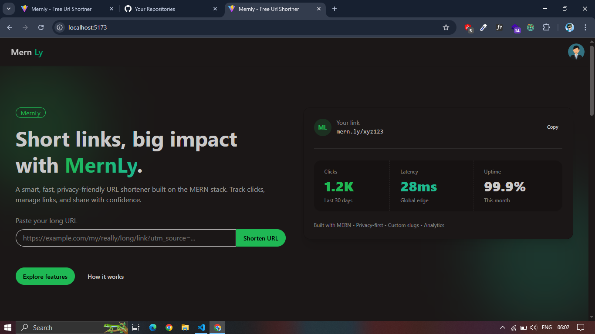
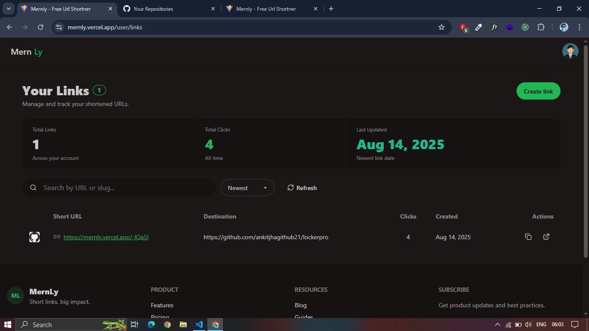

# MernLy — URL Shortener (MERN + Tailwind/daisyUI)

Short links, big impact. MernLy is a simple, fast, and privacy‑friendly URL shortener built with the MERN stack and a clean Tailwind CSS + daisyUI interface.

- Live demo: https://mernly.vercel.app
- Tech stack: MongoDB, Express, React (Vite), Node.js, Tailwind CSS, daisyUI

## Features

- Blazing‑fast link shortening with nanoid
- Smart URL handling (auto-add https:// when missing)
- Click tracking (increments on resolve)
- Auth: login/register with cookie-based sessions
- Responsive UI and components:
  - Hero, How it works, Features, Footer
  - Create Link page (with validation, loader, success state)
  - Links Dashboard (search, sort, stats, copy/open, mobile cards + desktop table)
  - Redirect page (loader + not found state)
- Accessible and themeable design via Tailwind + daisyUI
- Clean REST API

Note: Custom slugs, QR codes, expiry, and advanced analytics are great fits for the roadmap (see below).

## Screenshots

Add your screenshots here:




## Monorepo Structure

```
mernly/
├─ server/               # Express + MongoDB
│  ├─ src/
│  │  ├─ models/urlModel.js
│  │  ├─ controllers/urlController.js
│  │  ├─ routes/urlRoutes.js
│  │  └─ middleware/verifyToken.js
│  └─ .env
│
├─ client/               # React (Vite) + Tailwind + daisyUI
│  ├─ src/
│  │  ├─ pages/
│  │  │  ├─ CreateLinkPage.jsx
│  │  │  ├─ LinksPage.jsx
│  │  │  ├─ RedirectPage.jsx
│  │  │  ├─ LoginPage.jsx
│  │  │  └─ RegisterPage.jsx
│  │  ├─ components/
│  │  │  ├─ HeroSection.jsx
│  │  │  ├─ Features.jsx
│  │  │  ├─ HowItWorks.jsx
│  │  │  ├─ Footer.jsx
│  │  │  ├─ AuthForm.jsx
│  │  │  └─ Loader.jsx
│  │  └─ redux/authSlice.js
│  └─ .env
└─ README.md
```

## API Overview

Base URL: {SERVER_URL}/api

- POST /auth/register — { email, password } -> set auth cookie
- POST /auth/login — { email, password } -> set auth cookie
- POST /url/shorten — { longUrl } -> { shortUrl, _id } (auth required)
- GET /url/:shortId — -> { longUrl, clicks, shortUrl, _id } and increments click counter
- GET /links — -> all links created by the authenticated user (auth required)

Example: Create a short link
```http
POST /api/url/shorten
Content-Type: application/json
Credentials: include

{
  "longUrl": "https://example.com/very/long/url"
}
```

Response
```json
{
  "success": true,
  "message": "Short URL created successfully",
  "data": {
    "_id": "665c...",
    "shortUrl": "http://localhost:5173/abc123"
  }
}
```

Resolve a short link (server returns JSON; client redirects)
```http
GET /api/url/abc123
```

Response
```json
{
  "success": true,
  "data": {
    "_id": "665c...",
    "shortUrl": "abc123",
    "longUrl": "https://example.com/very/long/url",
    "clicks": 42
  }
}
```

## Server (Express + MongoDB)

Prerequisites:
- Node.js 18+
- MongoDB (local or Atlas)

Environment (.env)
```
PORT=8000
MONGO_URI=mongodb://localhost:27017/mernly
ORIGIN=http://localhost:5173          # used to build full short URLs    # allow the frontend origin
```

Install & run
```bash
cd server
npm install
npm run dev
# server on http://localhost:8000
```

Key snippets

Url model (clicks with default 0)
```js
const urlSchema = new mongoose.Schema({
  shortUrl: { type: String, required: true, unique: true, index: true },
  longUrl:  { type: String, required: true },
  owner:    { type: mongoose.Schema.Types.ObjectId, ref: "User" },
  clicks:   { type: Number, default: 0 },
}, { timestamps: true });
```

Create short URL
```js
// POST /api/url/shorten
// uses valid-url, nanoid, and ORIGIN for full link
```

Resolve + increment
```js
// GET /api/url/:shortId
// returns JSON and increments clicks; client performs the redirect
```

User links
```js
// GET /api/links
// returns all links for req.userId, sorted by newest
```

## Client (React + Vite)

Prerequisites:
- Node.js 18+

Environment (client/.env)
```
VITE_SERVER_URL=http://localhost:8000
# optional: used in dashboard to build full short URLs if needed
VITE_PUBLIC_WEB_ORIGIN=http://localhost:5173
```

Install & run
```bash
cd client
npm install
npm run dev
# app on http://localhost:5173
```

UI stack
- Tailwind CSS + daisyUI (theming via data-theme)
- lucide-react icons
- react-router-dom
- Redux Toolkit (auth)
- react-hot-toast

Routes (example)
- / — Landing (Hero, How it works, Features)
- / — Create short link
- /links — Your links dashboard
- /:shortId — Redirect page (fetches long URL then window.location.replace)
- /login — Login
- /register — Register

## Styling and Theming

- Tailwind configured with daisyUI plugin
- Switch themes by setting data-theme on the html/body or a wrapper:
```html
<html data-theme="light">...</html>
```
Popular themes: light, dark, corporate, retro — or create your own in tailwind.config.js.

## Development Notes

- Client fetches with credentials: "include" for cookie-based auth
- The Create Link page auto-normalizes protocol and validates with URL()
- The Redirect page:
  - shows a loader (“loading-infinity”) while resolving
  - redirects with window.location.replace to avoid polluting history
  - shows a friendly 404 or error with retry on failure
- The Links Dashboard includes search, sorting, responsive cards/table, and copy to clipboard with feedback

## Deployment

- Use MongoDB Atlas for the database
- Deploy server (Railway, Render, Fly.io, etc.) and set:
  - ORIGIN=https://your-frontend-domain
  - CORS_ORIGIN=https://your-frontend-domain
  - MONGO_URI=...
  - Set secure cookies and proper CORS (credentials true)
- Deploy client (Vercel/Netlify) and set:
  - VITE_SERVER_URL=https://your-api-domain
  - VITE_PUBLIC_WEB_ORIGIN=https://your-frontend-domain
- Configure your DNS so the short links resolve to the frontend where the redirect page lives

## Roadmap

- Custom slugs and link editing
- Link expiry and disabling
- QR code generation
- Rate limiting and abuse detection
- Advanced analytics (geo/device/referrer)
- Teams, roles, and shared workspaces
- Custom domains (bring your own domain)

## Scripts (suggested)

Server package.json
```json
{
  "scripts": {
    "dev": "nodemon src/index.js",
    "start": "node src/index.js"
  }
}
```

Client package.json
```json
{
  "scripts": {
    "dev": "vite",
    "build": "vite build",
    "preview": "vite preview"
  }
}
```

## Contributing

Issues and PRs are welcome! Please open an issue to discuss major changes.

## License

MIT. See LICENSE for details.

## Acknowledgements

- nanoid for short IDs
- valid-url for quick URL checks
- daisyUI for beautiful, accessible components
- lucide-react for icons